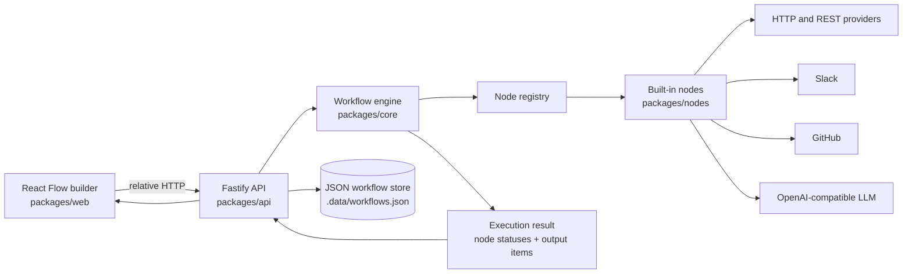
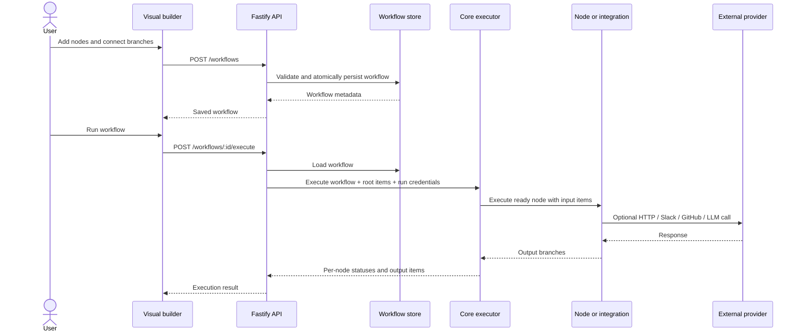
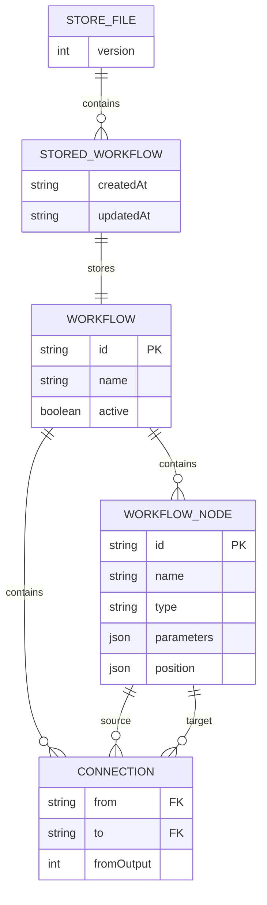
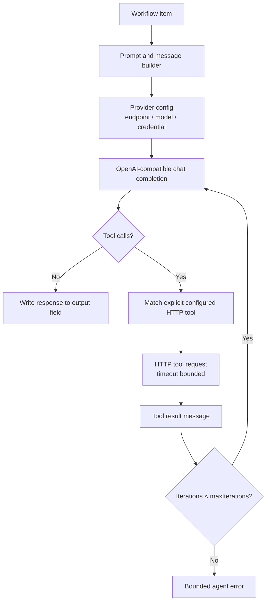
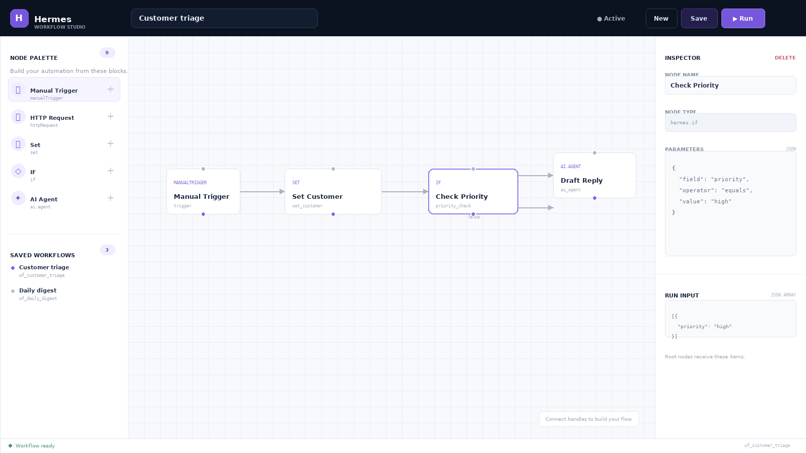
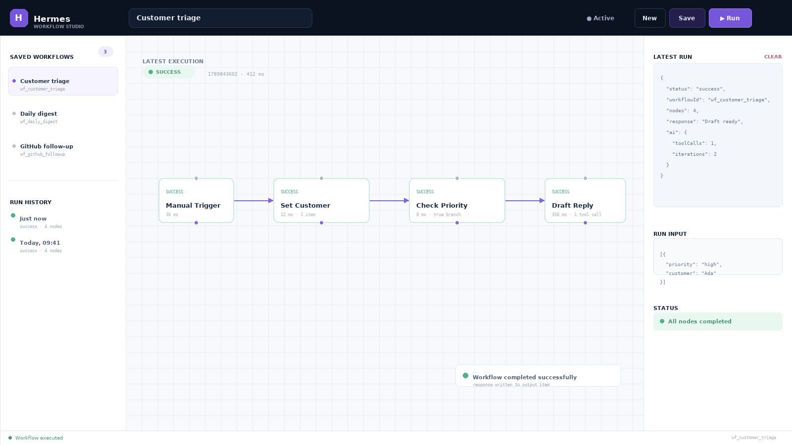

# Hermes

Hermes is a self-hostable workflow automation engine. Workflows are JSON graphs of nodes connected by
items (`{ json: { ... } }`) and can be built visually, persisted locally, executed through an API, or
run directly from the command line.

The current MVP includes a React Flow builder, a JSON-backed workflow repository, core transformation
nodes, Slack and GitHub integrations, and OpenAI-compatible chat and tool-calling agent nodes.

## Contents

- [Architecture diagram](#architecture-diagram)
- [System workflow](#system-workflow)
- [Feature list](#feature-list)
- [API documentation](#api-documentation)
- [Database schema](#database-schema)
- [AI architecture](#ai-architecture)
- [Security considerations](#security-considerations)
- [Testing](#testing)
- [Docker setup](#docker-setup)
- [CI/CD](#cicd)
- [Screenshots](#screenshots)
- [Demo](#demo)

## Architecture diagram



### Repository layout

```text
packages/
  core/     types, validation, topological execution, credentials, registry
  nodes/    core nodes, integrations, AI chat, AI agent, sandboxed code
  api/      Fastify routes, file-backed persistence, demo, tests
  web/      React + React Flow workflow builder
examples/
  sample-workflow.json
Dockerfile
docker-compose.yml
.github/workflows/ci.yml
```

## System workflow



Execution is a dependency-aware topological pass. Nodes with no incoming edges are roots; each node
runs after all of its upstream nodes have produced output. Branching nodes return multiple output arrays,
so an IF node can route true and false items independently. Cycles, invalid connections, malformed node
outputs, and unknown node types produce a structured execution error instead of hanging.

## Feature list

### Visual builder

- React Flow canvas with pan, zoom, minimap, grid, snap-to-grid, and branch-aware handles.
- Palette loaded from `GET /nodes`, including core, integration, and AI nodes.
- Inspector for node names and JSON parameters.
- Save/load workflows through the persistence API.
- Editable root input items and one-click execution.
- Latest execution result, status, node timing, and tool-call summary in the UI.
- Vite proxies `/workflows`, `/nodes`, and `/health` to the API during development.

Start it with two terminals:

```bash
pnpm dev:api
pnpm dev:web
```

Then open <http://localhost:5173>.

### Core execution

- Manual Trigger, HTTP Request, Set, IF, and sandboxed Code nodes.
- Workflow shape validation with path-specific issues.
- Deterministic graph execution with merged inputs and empty branch preservation.
- Per-node `waiting`, `running`, `success`, and `error` results.
- Per-run credentials that are supplied to nodes without being written to saved workflows.
- Idempotent built-in node registration for tests and hot reloads.

### Integrations

- `hermes.slack`: incoming webhook or Slack `chat.postMessage` delivery.
- `hermes.github`: configurable GitHub REST API method and path.
- Generic `hermes.httpRequest` node for other HTTP services.
- Request timeouts, response parsing, non-2xx handling, and simple `{{$json.field}}` interpolation.

### AI

- `hermes.ai.chat`: OpenAI-compatible `/chat/completions` requests.
- `hermes.ai.agent`: bounded function/tool-calling loop with explicit HTTP tools.
- Configurable provider endpoint, model, temperature, max tokens, credential namespace, and timeout.
- Agent `maxIterations` is limited to 1–10 to prevent unbounded loops.
- Local provider support through `OPENAI_BASE_URL` and per-run credentials.

## API documentation

Start the API with:

```bash
pnpm dev:api
```

The server listens on `0.0.0.0:3000` by default. Set `PORT`, `HOST`, and
`HERMES_WORKFLOW_STORE` to override defaults.

### Endpoints

| Method | Route | Purpose | Success |
|---|---|---|---|
| `GET` | `/` | API discovery document | `200` |
| `GET` | `/health` | Liveness check | `200` |
| `GET` | `/nodes` | Registered node metadata for the builder | `200` |
| `GET` | `/workflows` | List saved workflow summaries | `200` |
| `POST` | `/workflows` | Create or save a workflow | `201` |
| `GET` | `/workflows/:id` | Load a saved workflow | `200` |
| `PUT` | `/workflows/:id` | Replace a saved workflow | `200` |
| `DELETE` | `/workflows/:id` | Delete a saved workflow | `204` |
| `POST` | `/workflows/execute` | Execute an inline workflow | `200` |
| `POST` | `/workflows/:id/execute` | Execute a saved workflow | `200` |

A structurally invalid request returns `400` with an `issues` array. A structurally valid workflow
that fails during execution returns `422` with the complete `ExecutionResult`.

### Workflow shape

```json
{
  "id": "wf_demo",
  "name": "Demo Workflow",
  "active": false,
  "nodes": [
    {
      "id": "trigger",
      "name": "Manual Trigger",
      "type": "hermes.manualTrigger",
      "parameters": {},
      "position": [100, 120]
    }
  ],
  "connections": []
}
```

### Inline execution envelope

The direct workflow body remains supported. The envelope form adds root input items and credentials:

```json
{
  "workflow": {
    "id": "wf_1",
    "name": "Example",
    "nodes": [],
    "connections": []
  },
  "inputItems": [{ "json": { "name": "Ada" } }],
  "credentials": {
    "openai": { "apiKey": "never-commit-this" }
  }
}
```

Credentials are accepted for the duration of that execution only. They are not returned by workflow
GET endpoints and are not saved by `POST /workflows` or `PUT /workflows/:id`.

### Example request

```bash
curl -X POST http://localhost:3000/workflows/execute \
  -d @examples/sample-workflow.json
```

## Database schema

The default persistence layer is intentionally dependency-free JSON storage rather than a database.
The file is `.data/workflows.json` (override with `HERMES_WORKFLOW_STORE`). It has a versioned envelope
so a future Postgres repository can implement the same `WorkflowStore` interface.



Equivalent persisted shape:

```json
{
  "version": 1,
  "workflows": [
    {
      "createdAt": "2026-09-20T00:00:00.000Z",
      "updatedAt": "2026-09-20T00:00:00.000Z",
      "workflow": {
        "id": "wf_demo",
        "name": "Demo Workflow",
        "nodes": [],
        "connections": []
      }
    }
  ]
}
```

Writes are serialized and written to a temporary file before rename. `:memory:` is available for tests
and ephemeral deployments. Execution history is currently returned from the request and is not stored;
that is a planned Postgres-backed phase.

## AI architecture



`hermes.ai.chat` performs one completion per item. `hermes.ai.agent` sends the assistant tool call
back to the configured HTTP action, appends the tool result, and asks the model for a final response.
The provider is OpenAI-compatible by default but can be replaced with a local or hosted compatible
endpoint using `endpoint`, `OPENAI_BASE_URL`, or a credential's `baseUrl`.

Default environment variables:

```bash
OPENAI_API_KEY=...
OPENAI_MODEL=gpt-4o-mini
OPENAI_BASE_URL=https://api.openai.com/v1
```

## Security considerations

- **Credentials:** API keys are supplied through per-run credentials or environment variables. Do not
  put secrets in workflow JSON, screenshots, commits, or the JSON store.
- **Sandboxed code:** `hermes.code` runs user code in an `isolated-vm` isolate with a memory cap and
  execution timeout. Treat native dependencies as part of the trusted deployment boundary and keep
  `isolated-vm` patched.
- **Agent tools:** Agent tools are explicit HTTP actions and have a maximum iteration count. Tool URLs
  should be reviewed before activating a workflow; the current MVP does not provide a private-network
  allow/deny policy.
- **Outbound HTTP / SSRF:** HTTP, Slack, GitHub, and agent nodes can make outbound requests. Deploy
  Hermes behind egress controls and add an allowlist or network policy before accepting untrusted
  workflows.
- **API access:** Authentication, authorization, rate limiting, and tenant isolation are not included
  yet. Do not expose the API directly to the public internet without a reverse proxy and access control.
- **Persistence:** The JSON store is local application data. Restrict file permissions and mount it on
  a protected volume in Docker.
- **Input validation:** Workflows and node output branches are validated before they are accepted by the
  executor; validation is not a replacement for provider-specific permission checks.

## Testing

The test suite uses Node's test runner, Fastify injection, and local HTTP provider stubs. It does not
call Slack, GitHub, or an external LLM provider.

```bash
pnpm typecheck
pnpm test
pnpm build
```

The current suite covers:

- workflow validation, dependency resolution, cycles, branching, and sandboxed Code execution;
- persistence CRUD and saved-workflow execution;
- Slack, GitHub, AI Chat, and AI Agent provider behavior through local HTTP stubs;
- API health, node catalog, validation errors, and execution responses;
- TypeScript checks and Vite production compilation.

## Docker setup

Build and run the API and visual builder with Docker Compose:

```bash
docker compose up --build
```

- Builder: <http://localhost:5173>
- API: <http://localhost:3000>
- Workflow data: Docker volume `hermes-data`, mounted at `/app/.data`

The API image uses Node.js 20, Corepack/pnpm, and the same typecheck/build path as local development.
The web preview proxies API routes to the Compose `api` service. For a one-off API image:

```bash
docker build --target api -t hermes-api .
docker run --rm -p 3000:3000 -v hermes-data:/app/.data hermes-api
```

## CI/CD

GitHub Actions is defined in `.github/workflows/ci.yml`. Pull requests and pushes to `main` run:

1. Node.js 20 and Corepack setup;
2. `pnpm install --frozen-lockfile`;
3. `pnpm typecheck`;
4. `pnpm test`;
5. `pnpm build`.

The workflow is verification-only. Production deployment can consume the Docker image after these checks
pass; registry credentials and deployment targets are intentionally environment-specific.

## Screenshots

### Visual builder



The builder combines a node palette, React Flow canvas, branch connections, and a JSON parameter
inspector.

### Execution result



The execution view shows per-node success states, timing, branch selection, AI tool-call count, and the
latest JSON result.

## Demo

Run the sample workflow without a server:

```bash
pnpm demo
```

For the full application demo:

```bash
# terminal 1
pnpm dev:api

# terminal 2
pnpm dev:web
```

Then open <http://localhost:5173>, load or create a workflow, edit node parameters, click **Save**, and
click **Run**. The sample workflow is also available at
[`examples/sample-workflow.json`](examples/sample-workflow.json).

## License

TBD — recommend a fair-code style license if Hermes will be offered as both self-hosted and hosted SaaS.