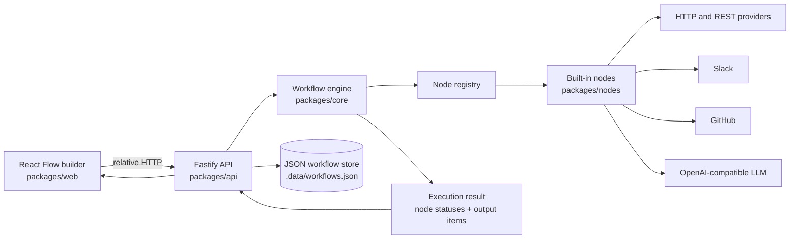
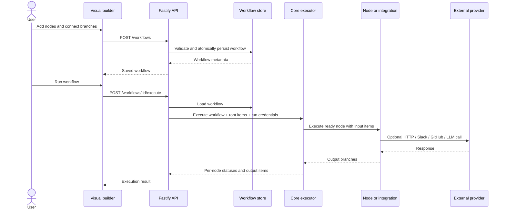
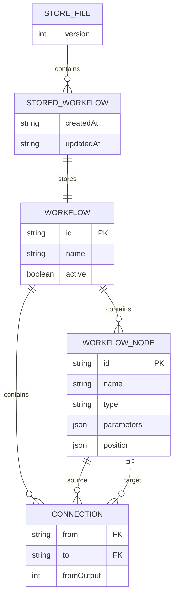
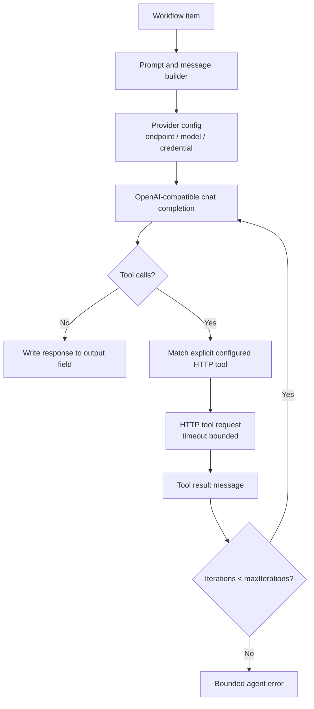
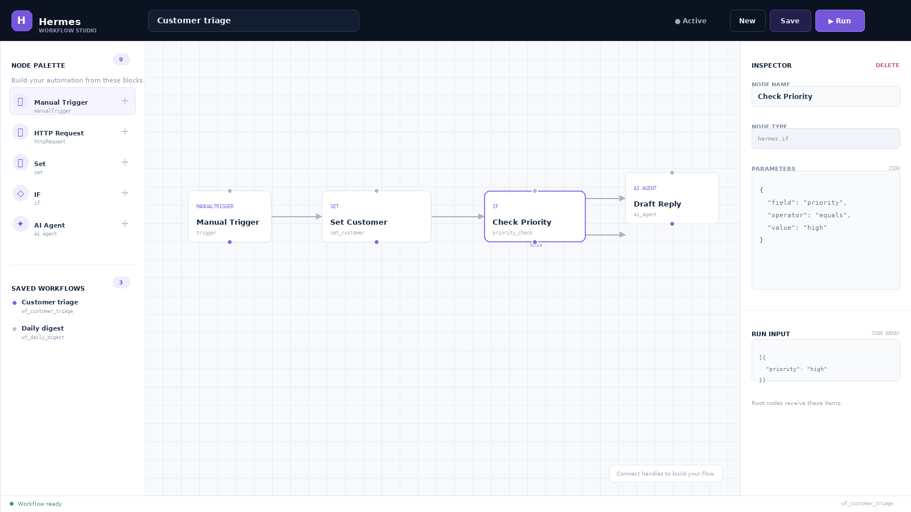
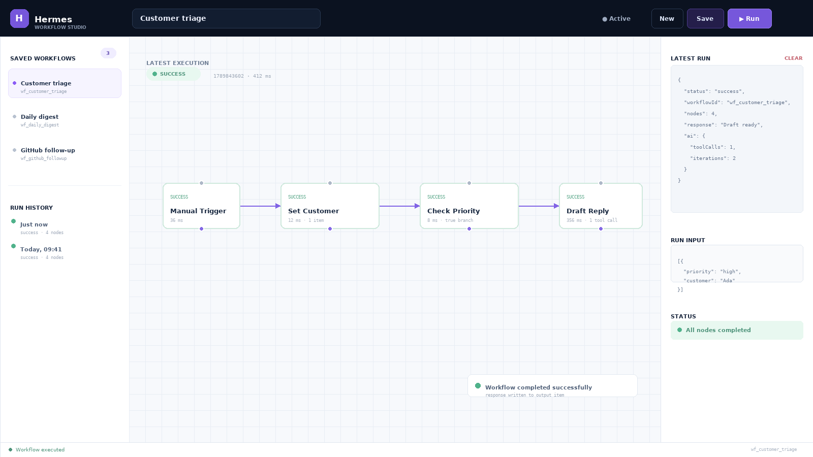

<div align="center">

# Hermes

**A self-hostable workflow automation engine.**
Build workflows visually, persist them locally, execute them through an API, or run them straight from the command line.

[](https://github.com/OWNER/hermes/actions/workflows/ci.yml)


[Quick Start](#quick-start) · [Features](#features) · [API Reference](#api-reference) · [Architecture](#architecture) · [Security](#security-considerations)

</div>

---

## Overview

Hermes models workflows as **JSON graphs of nodes** connected by **items** (`{ "json": { ... } }`). Graphs can be authored in a React Flow canvas, stored in a local JSON repository, and executed via a REST API or the CLI.

The current MVP ships with:

- A **React Flow** visual builder
- A **JSON-backed** workflow repository
- Core transformation nodes (Manual Trigger, HTTP Request, Set, IF, sandboxed Code)
- **Slack** and **GitHub** integrations
- **OpenAI-compatible** chat and tool-calling agent nodes

> [!WARNING]
> Hermes is an MVP. Authentication, authorization, rate limiting, and tenant isolation are **not** included yet. See [Security considerations](#security-considerations) before deploying.

## Table of Contents

- [Quick Start](#quick-start)
- [Features](#features)
- [Architecture](#architecture)
  - [Repository layout](#repository-layout)
  - [System workflow](#system-workflow)
  - [Execution model](#execution-model)
- [Built-in Nodes](#built-in-nodes)
- [API Reference](#api-reference)
- [Persistence](#persistence)
- [AI Architecture](#ai-architecture)
- [Configuration](#configuration)
- [Security Considerations](#security-considerations)
- [Testing](#testing)
- [Docker](#docker)
- [CI/CD](#cicd)
- [Screenshots](#screenshots)
- [Roadmap](#roadmap)
- [License](#license)

---

## Quick Start

### Prerequisites

- Node.js 20+
- [pnpm](https://pnpm.io/) (via Corepack: `corepack enable`)

### Run the sample workflow (no server)

```bash
pnpm install
pnpm demo
```

### Run the full app

Start the API and the visual builder in two terminals:

```bash
# Terminal 1 – API on :3000
pnpm dev:api

# Terminal 2 – Builder on :5173
pnpm dev:web
```

Open <http://localhost:5173>, load or create a workflow, edit node parameters, click **Save**, then click **Run**.

A ready-made workflow is available at [`examples/sample-workflow.json`](examples/sample-workflow.json).

### Run with Docker

```bash
docker compose up --build
```

| Service | URL |
|---|---|
| Builder | <http://localhost:5173> |
| API | <http://localhost:3000> |

---

## Features

### Visual builder

- React Flow canvas with pan, zoom, minimap, grid, snap-to-grid, and branch-aware handles
- Node palette loaded dynamically from `GET /nodes` (core, integration, and AI nodes)
- Inspector for node names and JSON parameters
- Save/load workflows through the persistence API
- Editable root input items and one-click execution
- Latest execution result with status, per-node timing, and tool-call summary
- Vite dev proxy for `/workflows`, `/nodes`, and `/health`

### Core execution

- Manual Trigger, HTTP Request, Set, IF, and sandboxed Code nodes
- Workflow shape validation with path-specific issues
- Deterministic graph execution with merged inputs and empty-branch preservation
- Per-node `waiting`, `running`, `success`, and `error` states
- Per-run credentials supplied to nodes **without** being written to saved workflows
- Idempotent built-in node registration for tests and hot reloads

### Integrations

- **Slack** – incoming webhook or `chat.postMessage` delivery
- **GitHub** – configurable REST API method and path
- **HTTP Request** – generic node for any other HTTP service
- Request timeouts, response parsing, non-2xx handling, and `{{$json.field}}` interpolation

### AI

- OpenAI-compatible `/chat/completions` chat node
- Bounded function/tool-calling agent with explicit HTTP tools
- Configurable endpoint, model, temperature, max tokens, credential namespace, and timeout
- Agent `maxIterations` limited to **1–10** to prevent unbounded loops
- Local provider support via `OPENAI_BASE_URL` and per-run credentials

---

## Architecture


```mermaid
flowchart LR
    Browser["React Flow builder<br/>packages/web"] -->|relative HTTP| API["Fastify API<br/>packages/api"]
    API --> Engine["Workflow engine<br/>packages/core"]
    API --> Store[("JSON workflow store<br/>.data/workflows.json")]
    Engine --> Registry[Node registry]
    Registry --> Builtins["Built-in nodes<br/>packages/nodes"]
    Builtins --> HTTP[HTTP and REST providers]
    Builtins --> Slack[Slack]
    Builtins --> GitHub[GitHub]
    Builtins --> LLM[OpenAI-compatible LLM]
    Engine --> Results["Execution result<br/>node statuses + output items"]
    Results --> API
    API --> Browser
```

### Repository layout

```text
packages/
  core/     Types, validation, topological execution, credentials, registry
  nodes/    Core nodes, integrations, AI chat, AI agent, sandboxed code
  api/      Fastify routes, file-backed persistence, demo, tests
  web/      React + React Flow workflow builder
examples/
  sample-workflow.json
Dockerfile
docker-compose.yml
.github/workflows/ci.yml
```

### System workflow


```mermaid
sequenceDiagram
    actor User
    participant UI as Visual builder
    participant API as Fastify API
    participant Store as Workflow store
    participant Engine as Core executor
    participant Node as Node or integration
    participant Provider as External provider

    User->>UI: Add nodes and connect branches
    UI->>API: POST /workflows
    API->>Store: Validate and atomically persist workflow
    Store-->>API: Workflow metadata
    API-->>UI: Saved workflow

    User->>UI: Run workflow
    UI->>API: POST /workflows/:id/execute
    API->>Store: Load workflow
    API->>Engine: Execute workflow + root items + run credentials
    Engine->>Node: Execute ready node with input items
    Node->>Provider: Optional HTTP / Slack / GitHub / LLM call
    Provider-->>Node: Response
    Node-->>Engine: Output branches
    Engine-->>API: Per-node statuses and output items
    API-->>UI: Execution result
```

### Execution model

Execution is a **dependency-aware topological pass**:

- Nodes with no incoming edges are **roots**.
- Each node runs only after all of its upstream nodes have produced output.
- Branching nodes return multiple output arrays, so an `IF` node can route `true` and `false` items independently.
- Cycles, invalid connections, malformed node outputs, and unknown node types produce a **structured execution error** instead of hanging.

---

## Built-in Nodes

| Type | Category | Description |
|---|---|---|
| `hermes.manualTrigger` | Core | Entry point for manual and API-driven runs |
| `hermes.httpRequest` | Core | Generic HTTP request with timeout, parsing, and interpolation |
| `hermes.set` | Core | Set or transform item fields |
| `hermes.if` | Core | Branch items into `true` / `false` outputs |
| `hermes.code` | Core | User code in an `isolated-vm` sandbox (memory cap + timeout) |
| `hermes.slack` | Integration | Incoming webhook or `chat.postMessage` delivery |
| `hermes.github` | Integration | Configurable GitHub REST API method and path |
| `hermes.ai.chat` | AI | One OpenAI-compatible chat completion per item |
| `hermes.ai.agent` | AI | Bounded tool-calling loop with explicit HTTP tools |

Use `GET /nodes` for the authoritative, runtime-registered node catalog.

---

## API Reference

Start the API:

```bash
pnpm dev:api
```

The server listens on `0.0.0.0:3000` by default.

### Endpoints

| Method | Route | Purpose | Success |
|---|---|---|---|
| `GET` | `/` | API discovery document | `200` |
| `GET` | `/health` | Liveness check | `200` |
| `GET` | `/nodes` | Registered node metadata for the builder | `200` |
| `GET` | `/workflows` | List saved workflow summaries | `200` |
| `POST` | `/workflows` | Create or save a workflow | `201` |
| `GET` | `/workflows/:id` | Load a saved workflow | `200` |
| `PUT` | `/workflows/:id` | Replace a saved workflow | `200` |
| `DELETE` | `/workflows/:id` | Delete a saved workflow | `204` |
| `POST` | `/workflows/execute` | Execute an inline workflow | `200` |
| `POST` | `/workflows/:id/execute` | Execute a saved workflow | `200` |

### Error responses

| Status | Meaning |
|---|---|
| `400` | Structurally invalid request. Body includes an `issues` array. |
| `422` | Structurally valid workflow that failed during execution. Body is the complete `ExecutionResult`. |

### Workflow shape

```json
{
  "id": "wf_demo",
  "name": "Demo Workflow",
  "active": false,
  "nodes": [
    {
      "id": "trigger",
      "name": "Manual Trigger",
      "type": "hermes.manualTrigger",
      "parameters": {},
      "position": [100, 120]
    }
  ],
  "connections": []
}
```

### Inline execution envelope

Sending a bare workflow body is still supported. The **envelope** form adds root input items and credentials:

```json
{
  "workflow": {
    "id": "wf_1",
    "name": "Example",
    "nodes": [],
    "connections": []
  },
  "inputItems": [{ "json": { "name": "Ada" } }],
  "credentials": {
    "openai": { "apiKey": "never-commit-this" }
  }
}
```

> [!NOTE]
> Credentials are accepted for the duration of that execution only. They are never returned by workflow `GET` endpoints and are not saved by `POST /workflows` or `PUT /workflows/:id`.

### Example request

```bash
curl -X POST http://localhost:3000/workflows/execute \
  -H "Content-Type: application/json" \
  -d @examples/sample-workflow.json
```

---

## Persistence

The default persistence layer is intentionally **dependency-free JSON storage** rather than a database. The file lives at `.data/workflows.json` (override with `HERMES_WORKFLOW_STORE`). It uses a versioned envelope so a future Postgres repository can implement the same `WorkflowStore` interface.


```mermaid
erDiagram
    STORE_FILE ||--o{ STORED_WORKFLOW : contains
    STORED_WORKFLOW ||--|| WORKFLOW : stores
    WORKFLOW ||--o{ WORKFLOW_NODE : contains
    WORKFLOW ||--o{ CONNECTION : contains
    WORKFLOW_NODE ||--o{ CONNECTION : source
    WORKFLOW_NODE ||--o{ CONNECTION : target

    STORE_FILE {
      int version
    }
    STORED_WORKFLOW {
      string createdAt
      string updatedAt
    }
    WORKFLOW {
      string id PK
      string name
      boolean active
    }
    WORKFLOW_NODE {
      string id PK
      string name
      string type
      json parameters
      json position
    }
    CONNECTION {
      string from FK
      string to FK
      int fromOutput
    }
```

<details>
<summary>Equivalent persisted JSON shape</summary>

```json
{
  "version": 1,
  "workflows": [
    {
      "createdAt": "2026-09-20T00:00:00.000Z",
      "updatedAt": "2026-09-20T00:00:00.000Z",
      "workflow": {
        "id": "wf_demo",
        "name": "Demo Workflow",
        "nodes": [],
        "connections": []
      }
    }
  ]
}
```

</details>

**Behavior notes**

- Writes are serialized and written to a temporary file before an atomic rename.
- `:memory:` is available for tests and ephemeral deployments.
- Execution history is currently returned from the request and **not stored**; persistent history is a planned Postgres-backed phase.

---

## AI Architecture


```mermaid
flowchart TD
    Input[Workflow item] --> Prompt[Prompt and message builder]
    Prompt --> Config["Provider config<br/>endpoint / model / credential"]
    Config --> Chat[OpenAI-compatible chat completion]
    Chat --> Decision{Tool calls?}
    Decision -->|No| Output[Write response to output field]
    Decision -->|Yes| Allowlist[Match explicit configured HTTP tool]
    Allowlist --> Tool["HTTP tool request<br/>timeout bounded"]
    Tool --> ToolResult[Tool result message]
    ToolResult --> Limit{"Iterations &lt; maxIterations?"}
    Limit -->|Yes| Chat
    Limit -->|No| Error[Bounded agent error]
```

- **`hermes.ai.chat`** performs one completion per item.
- **`hermes.ai.agent`** sends the assistant's tool call to the configured HTTP action, appends the tool result, and asks the model for a final response, up to `maxIterations` (1–10).
- The provider is OpenAI-compatible by default but can be swapped for any compatible local or hosted endpoint via `endpoint`, `OPENAI_BASE_URL`, or a credential's `baseUrl`.

---

## Configuration

### API server

| Variable | Default | Description |
|---|---|---|
| `PORT` | `3000` | API listen port |
| `HOST` | `0.0.0.0` | API listen host |
| `HERMES_WORKFLOW_STORE` | `.data/workflows.json` | Workflow store path (`:memory:` for ephemeral) |

### AI provider

| Variable | Default | Description |
|---|---|---|
| `OPENAI_API_KEY` | — | API key for the provider |
| `OPENAI_MODEL` | `gpt-4o-mini` | Default model |
| `OPENAI_BASE_URL` | `https://api.openai.com/v1` | Provider base URL (use for local/compatible providers) |

```bash
OPENAI_API_KEY=...
OPENAI_MODEL=gpt-4o-mini
OPENAI_BASE_URL=https://api.openai.com/v1
```

---

## Security Considerations

> [!IMPORTANT]
> Do not expose the API directly to the public internet without a reverse proxy and access control.

| Area | Guidance |
|---|---|
| **Credentials** | Supply API keys via per-run credentials or environment variables. Never put secrets in workflow JSON, screenshots, commits, or the JSON store. |
| **Sandboxed code** | `hermes.code` runs in an `isolated-vm` isolate with a memory cap and execution timeout. Treat native dependencies as part of the trusted deployment boundary and keep `isolated-vm` patched. |
| **Agent tools** | Tools are explicit HTTP actions with a maximum iteration count. Review tool URLs before activating a workflow; there is currently **no private-network allow/deny policy**. |
| **Outbound HTTP / SSRF** | HTTP, Slack, GitHub, and agent nodes make outbound requests. Deploy behind egress controls and add an allowlist or network policy before accepting untrusted workflows. |
| **API access** | Authentication, authorization, rate limiting, and tenant isolation are not included yet. |
| **Persistence** | The JSON store is local application data. Restrict file permissions and mount it on a protected volume in Docker. |
| **Input validation** | Workflows and node output branches are validated before execution. Validation does not replace provider-specific permission checks. |

---

## Testing

The test suite uses Node's test runner, Fastify injection, and local HTTP provider stubs. It does **not** call Slack, GitHub, or any external LLM provider.

```bash
pnpm typecheck
pnpm test
pnpm build
```

Current coverage:

- Workflow validation, dependency resolution, cycles, branching, and sandboxed Code execution
- Persistence CRUD and saved-workflow execution
- Slack, GitHub, AI Chat, and AI Agent provider behavior via local HTTP stubs
- API health, node catalog, validation errors, and execution responses
- TypeScript checks and Vite production compilation

---

## Docker

Build and run the API and visual builder:

```bash
docker compose up --build
```

| Item | Value |
|---|---|
| Builder | <http://localhost:5173> |
| API | <http://localhost:3000> |
| Workflow data | Docker volume `hermes-data`, mounted at `/app/.data` |

The API image uses Node.js 20, Corepack/pnpm, and the same typecheck/build path as local development. The web preview proxies API routes to the Compose `api` service.

One-off API image:

```bash
docker build --target api -t hermes-api .
docker run --rm -p 3000:3000 -v hermes-data:/app/.data hermes-api
```

---

## CI/CD

GitHub Actions is defined in [`.github/workflows/ci.yml`](.github/workflows/ci.yml). Pull requests and pushes to `main` run:

1. Node.js 20 and Corepack setup
2. `pnpm install --frozen-lockfile`
3. `pnpm typecheck`
4. `pnpm test`
5. `pnpm build`

The workflow is **verification-only**. Production deployment can consume the Docker image after these checks pass; registry credentials and deployment targets are intentionally environment-specific.

---

## Screenshots

### Visual builder



*Node palette, React Flow canvas, branch connections, and a JSON parameter inspector.*

### Execution result



*Per-node success states, timing, branch selection, AI tool-call count, and the latest JSON result.*

---

## Roadmap

- [ ] Postgres-backed `WorkflowStore` implementation
- [ ] Persistent execution history
- [ ] Authentication, authorization, rate limiting, and tenant isolation
- [ ] Private-network allow/deny policy for outbound HTTP and agent tools

---

## License

**TBD.** A fair-code style license is recommended if Hermes will be offered as both self-hosted and hosted SaaS.
